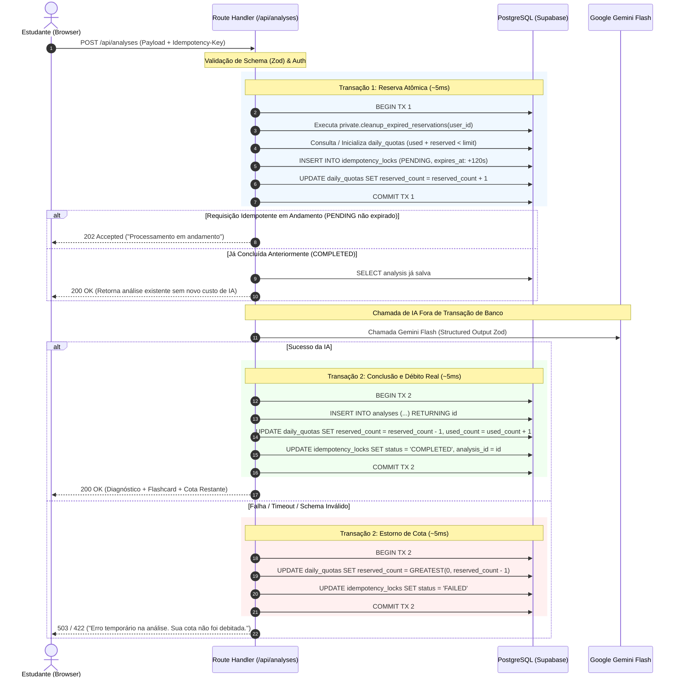

# Arquitetura e Especificação Técnica Definitiva: Anti-Erros | Método Aprender

---

## 1. Visão Geral e Objetivos do Produto

O **Anti-Erros | Método Aprender** é uma aplicação web voltada para estudantes e concurseiros que buscam diagnosticar com precisão pedagógica o motivo de terem errado uma questão e, quando pertinente, obter um flashcard cirúrgico formatado no **Método Aprender**.

### Fluxo Central
1. **Identificação & Aceite:** Cadastro simples (nome, e-mail), aceite obrigatório dos Termos de Uso e Política de Privacidade (LGPD) e consentimento opcional e segregado de marketing.
2. **Entrada do Erro:** O estudante cola o enunciado da questão, alternativas, a resposta que marcou, o gabarito oficial e (opcionalmente) por que acredita ter errado.
3. **Diagnóstico por IA (Gemini Flash):** A IA classifica a falha em taxonomia fechada (ex: *Falta de Atenção*, *Lacuna Teórica*, *Interpretação*, *Pegadinha/Distrator*), gera uma justificativa didática curta e avalia se o erro justifica a criação de flashcard.
4. **Flashcard em 1 Clique:** Se indicado, gera Frente (pergunta cirúrgica/gatilho) e Verso (conceito-chave conciso), pronto para cópia rápida.
5. **Conversão & Monetização:** Exibição contextual e não invasiva do Call-to-Action (CTA) para o e-book *Método Aprender*.

---

## 2. Decisões Arquiteturais e Stack Tecnológica

| Componente | Tecnologia / Versão | Decisão Técnica & Justificativa |
| :--- | :--- | :--- |
| **Frontend & Backend** | **Next.js 16.3.3** (App Router, React 19, TypeScript strict) | Versão fixada rigidamente no `package.json` sem `^` ou `~`. Execução fullstack com SSR e Route Handlers seguros. |
| **Estilização & UI** | **Tailwind CSS + shadcn/ui** | Componentes acessíveis (Radix UI), layout limpo, moderno, responsivo e sem excesso de animações. |
| **Banco de Dados & Auth** | **Supabase (PostgreSQL 15+ & Supabase Auth)** | Auth via Magic Link / OTP com `@supabase/ssr` (`getAll`/`setAll`), RLS estrito em todas as tabelas. |
| **Motor de IA** | **Google Gemini Flash (Server-Side via SDK oficial)** | Structured Outputs com JSON Schema validado via Zod. Modelo configurável por `GEMINI_MODEL_NAME`. |
| **Validação de Dados** | **Zod** | Validação isomórfica de entradas de API, payloads de IA e formulários. |

---

## 3. Modelo de Dados e Esquema Relacional (PostgreSQL / Supabase)

### 3.1 Esquema e Tabelas

```sql
-- 1. Profiles (Sincronizado com auth.users)
CREATE TABLE public.profiles (
    id UUID PRIMARY KEY REFERENCES auth.users(id) ON DELETE CASCADE,
    full_name TEXT NOT NULL,
    email TEXT NOT NULL, -- Sincronizado unicamente pelo backend a partir de auth.users
    created_at TIMESTAMPTZ NOT NULL DEFAULT timezone('utc'::text, now()),
    updated_at TIMESTAMPTZ NOT NULL DEFAULT timezone('utc'::text, now())
);

-- 2. Aceites Legais Obrigatórios (LGPD - Termos e Privacidade)
CREATE TABLE public.legal_acceptances (
    id UUID PRIMARY KEY DEFAULT gen_random_uuid(),
    user_id UUID NOT NULL REFERENCES auth.users(id) ON DELETE CASCADE,
    terms_accepted BOOLEAN NOT NULL DEFAULT true,
    privacy_accepted BOOLEAN NOT NULL DEFAULT true,
    policy_version TEXT NOT NULL,
    ip_address TEXT,
    user_agent TEXT,
    created_at TIMESTAMPTZ NOT NULL DEFAULT timezone('utc'::text, now())
);

-- 3. Consentimento de Marketing (Append-Only Log)
CREATE TABLE public.marketing_consent_events (
    id UUID PRIMARY KEY DEFAULT gen_random_uuid(),
    user_id UUID NOT NULL REFERENCES auth.users(id) ON DELETE CASCADE,
    consented BOOLEAN NOT NULL,
    policy_version TEXT NOT NULL,
    ip_address TEXT,
    user_agent TEXT,
    created_at TIMESTAMPTZ NOT NULL DEFAULT timezone('utc'::text, now())
);

-- View para consulta do estado atual de marketing com security_invoker
CREATE OR REPLACE VIEW public.v_current_marketing_consent
WITH (security_invoker = true) AS
SELECT DISTINCT ON (user_id)
    id,
    user_id,
    consented,
    policy_version,
    created_at
FROM public.marketing_consent_events
ORDER BY user_id, created_at DESC;

-- 4. Cotas Diárias de Análise
CREATE TABLE public.daily_quotas (
    id UUID PRIMARY KEY DEFAULT gen_random_uuid(),
    user_id UUID NOT NULL REFERENCES auth.users(id) ON DELETE CASCADE,
    quota_date DATE NOT NULL DEFAULT CURRENT_DATE,
    daily_limit INT NOT NULL DEFAULT 5,
    used_count INT NOT NULL DEFAULT 0,
    reserved_count INT NOT NULL DEFAULT 0,
    created_at TIMESTAMPTZ NOT NULL DEFAULT timezone('utc'::text, now()),
    updated_at TIMESTAMPTZ NOT NULL DEFAULT timezone('utc'::text, now()),
    CONSTRAINT uq_user_quota_date UNIQUE(user_id, quota_date),
    CONSTRAINT chk_quota_limit CHECK (used_count + reserved_count <= daily_limit)
);

-- 5. Controle de Idempotência e Bloqueio Atômico
CREATE TABLE public.idempotency_locks (
    id UUID PRIMARY KEY DEFAULT gen_random_uuid(),
    user_id UUID NOT NULL REFERENCES auth.users(id) ON DELETE CASCADE,
    idempotency_key TEXT NOT NULL,
    quota_date DATE NOT NULL DEFAULT CURRENT_DATE,
    status TEXT NOT NULL CHECK (status IN ('PENDING', 'COMPLETED', 'FAILED')),
    analysis_id UUID,
    expires_at TIMESTAMPTZ NOT NULL DEFAULT (now() + interval '120 seconds'),
    created_at TIMESTAMPTZ NOT NULL DEFAULT timezone('utc'::text, now()),
    updated_at TIMESTAMPTZ NOT NULL DEFAULT timezone('utc'::text, now()),
    CONSTRAINT uq_user_idempotency UNIQUE(user_id, idempotency_key)
);

-- 6. Análises e Diagnósticos Pedagógicos
CREATE TABLE public.analyses (
    id UUID PRIMARY KEY DEFAULT gen_random_uuid(),
    user_id UUID NOT NULL REFERENCES auth.users(id) ON DELETE CASCADE,
    raw_question TEXT NOT NULL,
    user_answer TEXT NOT NULL,
    correct_answer TEXT NOT NULL,
    user_hypothesis TEXT,
    error_type TEXT NOT NULL,
    root_cause_explanation TEXT NOT NULL,
    learning_gap_concept TEXT NOT NULL,
    suggested_flashcard_front TEXT,
    suggested_flashcard_back TEXT,
    is_flashcard_worthy BOOLEAN NOT NULL DEFAULT true,
    ai_confidence NUMERIC(4,3) NOT NULL,
    model_version TEXT NOT NULL,
    prompt_version TEXT NOT NULL,
    created_at TIMESTAMPTZ NOT NULL DEFAULT timezone('utc'::text, now())
);

-- 7. Telemetria e Analytics Operacional Sanitizado (Sem PII)
CREATE TABLE public.events (
    id UUID PRIMARY KEY DEFAULT gen_random_uuid(),
    user_id UUID REFERENCES auth.users(id) ON DELETE CASCADE,
    event_name TEXT NOT NULL,
    session_id TEXT,
    properties JSONB NOT NULL DEFAULT '{}'::jsonb,
    created_at TIMESTAMPTZ NOT NULL DEFAULT timezone('utc'::text, now())
);
```

---

## 4. Segurança, Privilégios e Políticas RLS (Row Level Security)

### 4.1 Schema Privado e Função de Limpeza de Reservas Expiradas

```sql
CREATE SCHEMA IF NOT EXISTS private;

CREATE OR REPLACE FUNCTION private.cleanup_expired_reservations(target_user_id UUID)
RETURNS VOID
LANGUAGE plpgsql
SECURITY DEFINER
SET search_path = ''
AS $$
DECLARE
    rec RECORD;
BEGIN
    FOR rec IN
        WITH expired_locks AS (
            UPDATE public.idempotency_locks
            SET status = 'FAILED', updated_at = timezone('utc'::text, now())
            WHERE user_id = target_user_id
              AND status = 'PENDING'
              AND expires_at < timezone('utc'::text, now())
            RETURNING quota_date, 1 AS count_expired
        )
        SELECT quota_date, COUNT(*) as total_expired
        FROM expired_locks
        GROUP BY quota_date
    LOOP
        UPDATE public.daily_quotas
        SET reserved_count = GREATEST(0, reserved_count - rec.total_expired),
            updated_at = timezone('utc'::text, now())
        WHERE user_id = target_user_id
          AND quota_date = rec.quota_date;
    END LOOP;
END;
$$;

-- Restrição absoluta de privilégios de execução
REVOKE EXECUTE ON FUNCTION private.cleanup_expired_reservations(UUID) FROM PUBLIC, anon, authenticated;
GRANT EXECUTE ON FUNCTION private.cleanup_expired_reservations(UUID) TO service_role;
```

### 4.2 Regras RLS por Tabela

- **`profiles`**: `SELECT` permitido para o próprio usuário (`auth.uid() = id`). Nenhuma escrita direta via browser (`INSERT`/`UPDATE` bloqueados no client).
- **`legal_acceptances`**: `SELECT` do próprio usuário. `INSERT` exclusivo do backend server-side.
- **`marketing_consent_events`**: `SELECT` do próprio usuário. `INSERT` exclusivo do backend server-side.
- **`daily_quotas`**: `SELECT` do próprio usuário. `INSERT`/`UPDATE` exclusivos do backend server-side.
- **`idempotency_locks`**: Bloqueada leitura e escrita direta no client (100% server-side via service role).
- **`analyses`**: `SELECT` e `DELETE` permitidos para o próprio usuário. `INSERT` e `UPDATE` bloqueados no client (100% server-side via backend).
- **`events`**: Apenas `SELECT` para administradores (`auth.jwt()->'app_metadata'->>'role' = 'admin'`). `INSERT` via rota de API server-side sanitizada.

---

## 5. Fluxo Transacional Desacoplado: Cota e Idempotência

Para evitar manter locks ou conexões do PostgreSQL abertos durante a inferência do Gemini (que pode levar de 3 a 8 segundos), a operação é dividida em **2 transações ultrarrápidas (<5ms)**:



---

## 6. Planejamento das Sprints de Implementação

- **Sprint 1 (Fundação e Setup):** Inicialização Git/GitHub, Next.js 16.3.3 rigidamente fixado, TypeScript, Tailwind, shadcn/ui, migrações SQL (7 tabelas + private RPC + RLS), utilitários `@supabase/ssr` e suíte de testes de ambiente.
- **Sprint 2 (Autenticação, Perfil & Consentimentos LGPD):** Magic Link, formulário de cadastro, rotas `/api/legal-acceptances` e `/api/marketing-consent`, middleware de proteção de rotas.
- **Sprint 3 (Motor de Diagnóstico & Benchmark Gemini):** Schemas Zod, prompts pedagógicos do Método Aprender, benchmark comparativo de modelos, API `/api/analyses` com transação em 2 fases.
- **Sprint 4 (Interface do Estudante & Histórico):** Formulário de questão, visualização didática do diagnóstico, cópia do flashcard em 1 clique, histórico de análises do usuário.
- **Sprint 5 (Landing Page, Conversão & Painel Admin):** Landing page, CTA contextual do e-book, ingestão de analytics sanitizado (`/api/events`) e painel `/admin`.
- **Sprint 6 (LGPD Hardening, Testes E2E & Produção):** Rota de exclusão de conta em cascata (`DELETE /api/account`), testes E2E Playwright e checklist de deploy.

---
Documento homologado e aprovado para execução.
