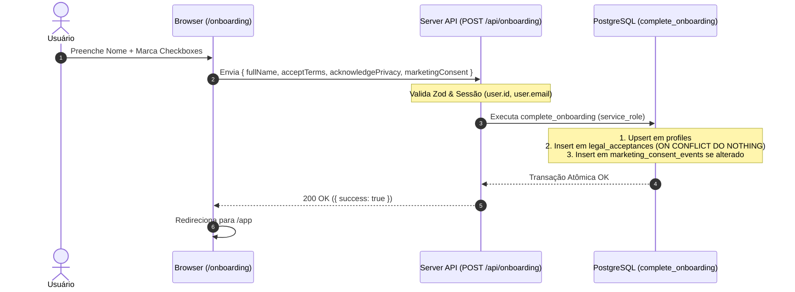

# Documentação da Sprint 2: Autenticação, Onboarding Obrigatório e Consentimentos LGPD

## 1. Visão Geral

A **Sprint 2** estabelece a camada de autenticação sem senhas, verificação de onboarding obrigatório, aceites legais auditáveis (Termos de Uso e Política de Privacidade), consentimento segregado de marketing e gerenciamento de perfil do usuário, preservando o princípio arquitetural de **zero escrita direta pelo navegador nas tabelas de domínio**.

---

## 2. Arquitetura e Fluxo de Dados

### 2.1 Autenticação por Magic Link (Supabase Auth OTP)

1. O usuário informa seu endereço de e-mail na rota pública `/login`.
2. O cliente invoca `supabase.auth.signInWithOtp` com redirecionamento para `/auth/callback`.
3. Uma mensagem genérica é exibida em tela (*"Se o endereço informado puder receber acesso, enviamos um link para o seu e-mail"*), prevenindo enumeração de contas.
4. O link contém o código OTP que é validado no Route Handler `/auth/callback` via `supabase.auth.exchangeCodeForSession(code)`.
5. Os cookies de sessão são gerenciados e sincronizados via `@supabase/ssr` (`getAll` / `setAll`) no servidor e no middleware.

### 2.2 Onboarding Obrigatório e Atomicidade

Nenhum usuário acessa `/app` ou `/conta` sem cumprir cumulativamente:
- E-mail autenticado (`auth.users.email`);
- Nome completo válido (mínimo 2 caracteres);
- Aceite da versão vigente dos Termos de Uso (`legal_acceptances`);
- Registro de ciência da versão vigente da Política de Privacidade (`legal_acceptances`).

O consentimento de marketing é **opcional** e mantido desmarcado por padrão.



### 2.3 Gestão de Versões Legais

As versões vigentes são centralizadas em `src/config/legal.ts`:
- `TERMS_VERSION`: `v1.0.0`
- `PRIVACY_VERSION`: `v1.0.0`
- `MARKETING_POLICY_VERSION`: `v1.0.0`

---

## 3. Segurança e Regras RLS

- **Zero Escrita Direta**: Todas as tentativas de `INSERT` ou `UPDATE` diretos por clientes autenticados (`authenticated`) ou anônimos (`anon`) em `profiles`, `legal_acceptances` ou `marketing_consent_events` continuam bloqueadas por RLS.
- **Função RPC Protegida**: `public.complete_onboarding` possui `SECURITY DEFINER` e permissão de execução concedida exclusivamente para `service_role`.
- **E-mail Canônico**: `profiles.email` é uma cópia sincronizada derivada unicamente de `auth.users.email`. O cliente não pode alterar ou forjar e-mails.

---

## 4. Endpoints da Sprint 2

| Método | Rota | Descrição |
| :--- | :--- | :--- |
| `GET` | `/auth/callback` | Valida código OTP e redireciona condicionalmente para `/app` ou `/onboarding`. |
| `POST` | `/api/onboarding` | Executa onboarding atômico e registra aceites legais. |
| `PATCH` | `/api/profile` | Atualiza o `full_name` do perfil do usuário autenticado. |
| `POST` | `/api/marketing-consent` | Registra novo evento append-only de consentimento de marketing (idempotente). |
| `POST` | `/api/auth/logout` | Encerra a sessão ativa do usuário e limpa cookies. |

---

## 5. Como Testar e Manter

```bash
# Executar suíte de testes unitários (Zod, regras de nome, versões legais)
npm run test

# Executar testes de integração empírica (RLS, atomicidade, concorrência, RPC)
npm run test:integration

# Typecheck e Linter
npm run lint
npx tsc --noEmit

# Build de produção
npm run build
```
