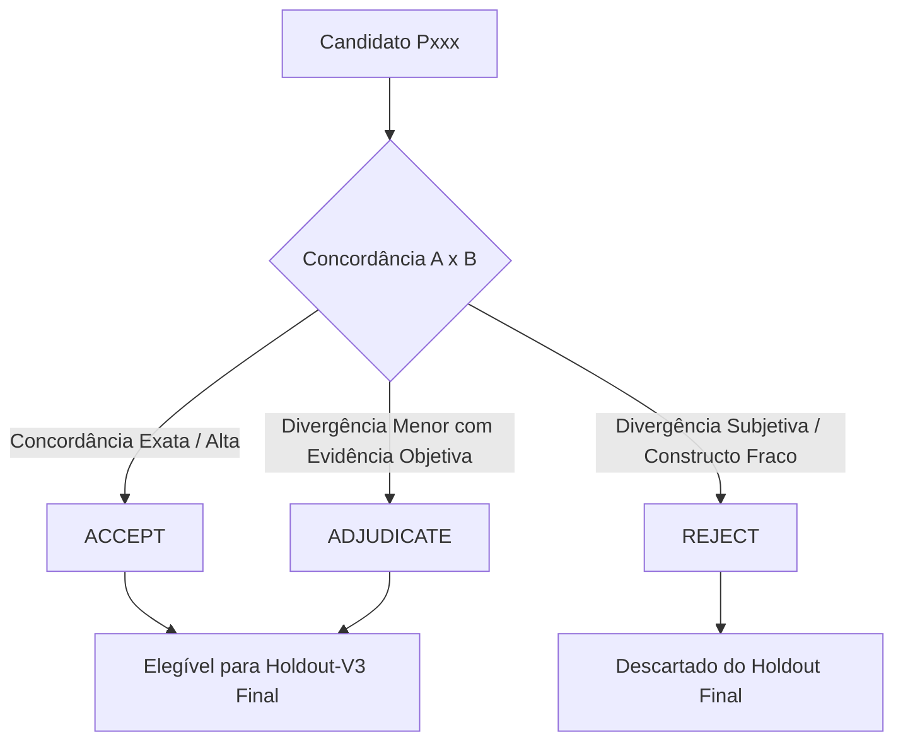

# Sprint 3 — Protocolo do Holdout-V3 Baseado em Reprodutibilidade Humana

## 0. Status, Propósito e Histórico Metodológico

Este protocolo formaliza e congela a metodologia de validação empírica final para o motor `analysis-v2.1` no projeto **anti_erros**. 

### 0.1 Contexto de Execução
- O motor `analysis-v2.1` permanece **ESTRITAMENTE CONGELADO** desde o commit `7275e6a`.
- O motor **NÃO** foi executado contra o `holdout-v2` e não será executado até o congelamento formal do `holdout-v3`.
- Os conjuntos anteriores (`benchmark-v2`, `holdout-v1` e `holdout-v2`) foram reclassificados como instrumentos exclusivamente exploratórios/diagnósticos.

### 0.2 Diagnóstico do Holdout-V2 e Motivação do Holdout-V3
A análise metodológica do `holdout-v2` revelou que a presunção de que o "autor do caso detém o ground truth" fragiliza o teste de generalização. Quando um conjunto de teste é criado diretamente no tamanho exato (120 casos) pelo autor A, casos com sutilezas diagnósticas ou classificações limítrofes são mantidos artificialmente apenas para preencher cotas, resultando em:
1. **Subdeterminação do Ground Truth:** Casos em que a categoria pretendida pelo autor não é a única causalmente sustentada pelos dados observáveis.
2. **Subpoder do Gate de Incerteza:** Dificuldade em garantir que os casos de `INSUFFICIENT_INFORMATION` representem verdadeira indeterminação diagnóstica para múltiplos avaliadores humanos independentes.
3. **Divergência em Decisões de Flashcard:** Julgamentos intuitivos de `CREATE` vs `NO_CARD` sem critérios objetivos e verificáveis.

Portanto, o **Holdout-V3** adota como postulado central: **o ground truth não pertence ao autor do caso, mas é uma propriedade emergente do consenso e da reprodutibilidade inter-anotadores**.

---

## 1. Princípio Fundamental: Reprodutibilidade como Condição de Validade

1. **A Intenção do Autor Não é Evidência:** A categoria ou decisão pretendida pelo Anotador A ao redigir o caso não possui valor probatório. O caso deve sustentar sua causalidade exclusivamente a partir dos seus 4 campos observáveis públicos (`question`, `userAnswer`, `correctAnswer`, `officialExplanation`).
2. **Validação Cega Cruzada Obrigatória:** Todo caso deve ser avaliado independentemente pelo Anotador B sem qualquer conhecimento da intenção de A, da categoria proposta ou de metadados internos.
3. **Inadmissibilidade de Casos Ambíguos no Dataset Final:** Se dois anotadores humanos competentes e independentes não conseguem reproduzir o diagnóstico causal ou a decisão de card a partir dos campos do caso, o caso é metodologicamente inválido para testar o modelo e deve ser **rejeitado**.

---

## 2. Arquitetura do Candidate Pool (180 Casos)

Para garantir que o conjunto final de 120 casos seja composto exclusivamente por itens de alta reprodutibilidade sem comprometer o equilíbrio taxonômico, a construção utilizará um **Candidate Pool** ampliado de **180 casos candidatos**.

### 2.1 Estrutura do Pool
- **Tamanho do Pool:** Exatamente **180 casos candidatos**.
- **Identificadores Candidatos:** `P001` a `P180` (estritamente neutros).
- **Composição Proposta pelo Anotador A (Meta Preliminar):**
  - ~30 `KNOWLEDGE_GAP`
  - ~30 `CONCEPT_CONFUSION`
  - ~30 `EXCEPTION_MISSED`
  - ~30 `APPLICATION_ERROR`
  - ~30 `READING_ERROR`
  - ~30 `INSUFFICIENT_INFORMATION`
- **Isolamento de B:** O Anotador B recebe apenas o arquivo com os 4 campos observáveis de `P001` a `P180`, sem conhecer a distribuição ou a pretensão de A.

---

## 3. Estados dos Casos e Critérios de Admissão no Holdout Final

Após a anotação independente de A e B, o **Agente C** realiza a análise inter-anotadores sobre os 180 candidatos e classifica cada caso em um de três estados:



### 3.1 Definições dos Estados

1. **`ACCEPT`:**
   - Concordância bilateral plena em `expectedErrorType`, `diagnosticIndeterminate` e `expectedCardDecision`;
   - Factualidade inquestionável e campos observáveis claros e suficientes.
2. **`ADJUDICATE`:**
   - Divergência menor entre categorias adjacentes (ex: `APPLICATION_ERROR` vs `READING_ERROR` em questão numérica) onde o texto do enunciado ou da resposta do aluno contém evidência direta, objetiva e incontestável que permite a C determinar o ground truth sem inferir intenções invisíveis.
   - Ambas as anotações são registradas em `acceptableErrorTypes`.
3. **`REJECT`:**
   - Divergência essencial e insolúvel na causa provável do erro;
   - Decisão de card estritamente subjetiva que não atende aos quatro eixos objetivos;
   - Dúvida factual material no enunciado ou no gabarito;
   - Casos cuja sustentação dependa de premissas ocultas pretendidas por A.

### 3.2 Regra de Ouro da Imutabilidade dos Candidatos
**É estritamente proibido editar o texto de um caso após a anotação de B para forçar concordância.** Qualquer caso que apresente redação defeituosa ou ambiguidade indesejada deve ser sumariamente marcado como `REJECT`. Se faltarem casos em uma categoria, novos candidatos deverão ser gerados em rodada suplementar independente.

---

## 4. Constructo Rigoroso de Incerteza Diagnóstica (`INSUFFICIENT_INFORMATION`)

### 4.1 Regra Forte de Admissão para II
Para que um caso componha o ground truth final como `expectedErrorType = INSUFFICIENT_INFORMATION`, é **obrigatório** que:
$$\text{A}(\text{diagnosticIndeterminate} = \text{YES}) \land \text{B}(\text{diagnosticIndeterminate} = \text{YES})$$
$$\text{A}(\text{expectedErrorType} = \text{II}) \land \text{B}(\text{expectedErrorType} = \text{II})$$
*(Ressalva: exceção admitida apenas em caso de erro material formal e comprovável de um anotador contra evidência explícita no texto).*

### 4.2 Requisito de Justificativa Estruturada para II
Todo caso candidato a `INSUFFICIENT_INFORMATION` deve conter, na justificativa de A e na adjudicação de C:
1. **Causa Plausível 1:** (ex: `KNOWLEDGE_GAP` — ausência da regra jurídica específica);
2. **Causa Plausível 2:** (ex: `CONCEPT_CONFUSION` — troca simétrica de institutos);
3. **Compatibilidade Bicausal:** Demonstração de por que os 4 campos observáveis sustentam ambas as hipóteses com igual plausibilidade;
4. **Informação Ausente:** Identificação precisa do dado que falta (ex: justificativa escrita do aluno ou passo intermediário do cálculo) para que houvesse desempate causal.

Se a justificativa não puder apontar duas causas concorrentes reais ou se a ausência de sinal não for genuína, o caso é metodologicamente inválido para II.

---

## 5. Dois Eixos de Indeterminação e Matriz de Controles Cruzados

### 5.1 Distinção Formal
- **`answerIndeterminate` (YES/NO):** Propriedade da questão/problema em si. `YES` indica que o enunciado é subdeterminado, incompleto ou admite múltiplas respostas corretas.
- **`diagnosticIndeterminate` (YES/NO):** Propriedade diagnóstica dos 4 campos. `YES` indica que não há evidência suficiente para determinar a causa pedagógica provável do erro do aluno.

**Regra Inviolável:** `answerIndeterminate = YES` **NÃO** determina `INSUFFICIENT_INFORMATION`. Somente `diagnosticIndeterminate = YES` sustenta a incerteza diagnóstica.

### 5.2 Matriz de Controles no Holdout-V3 Final (120 Casos)

| Controle | `answerIndeterminate` | `diagnosticIndeterminate` | Cota no Holdout Final | Finalidade Metodológica |
|---|:---:|:---:|:---:|---|
| **Controle A** | **YES** | **NO** | $\ge 10$ casos | Medir imunidade a falso atalho de II em questões abertas com erro causal óbvio (distribuído entre categorias não-II). |
| **Controle B** | **NO** | **YES** | $\ge 8$ casos | Medir detecção de incerteza diagnóstica genuína em questões perfeitamente respondíveis (respostas opacas/chutes). |
| **Controle C** | **YES** | **YES** | Até 12 casos | Medir reconhecimento de incerteza em cenários duplamente indeterminados. |
| **Controle D** | **NO** | **NO** | Restante (~90 casos) | Casos normais determinados (distribuição padrão das 5 categorias específicas). |

**Poder Estatístico do Gate de Incerteza:** O conjunto final conterá exatamente **20 casos** com `diagnosticIndeterminate = YES` (somatório de Controles B e C), garantindo o denominador oficial do gate de Uncertainty Handling.

---

## 6. Observabilidade e Articulação Formal

1. **`CLEAR`:** Evidência causal nítida e unívoca $\implies \text{diagnosticIndeterminate} = \text{NO}$.
2. **`AMBIGUOUS`:** Duas ou mais categorias permanecem plausíveis e defensáveis a partir dos dados $\implies$ Formalizado como gerador de incerteza diagnóstica ($\text{diagnosticIndeterminate} = \text{YES}$). É proibida a marcação `AMBIGUOUS` com `diagnosticIndeterminate = NO` sem justificativa formal de prevalência hierárquica.
3. **`UNOBSERVABLE`:** Ausência total de evidência diagnóstica $\implies \text{diagnosticIndeterminate} = \text{YES}$ e $\text{expectedErrorType} = \text{INSUFFICIENT\_INFORMATION}$.

---

## 7. Política Objetiva de Flashcard em Quatro Eixos

Para eliminar a subjetividade na decisão de `CREATE` vs `NO_CARD`, todo caso anotado por A e B deverá avaliar explicitamente quatro critérios binários:

1. **`stableContent` (YES/NO):** O conceito, regra ou fato possui estabilidade normativa, científica ou gramatical?
2. **`generalizableContent` (YES/NO):** O conteúdo aprendido possui aplicação além desta questão pontual?
3. **`retrievableContent` (YES/NO):** É viável formular um flashcard atômico com estímulo e resposta inequívocos?
4. **`futureReviewUseful` (YES/NO):** A repetição espaçada deste item gera benefício real de retenção para o estudante?

### 7.1 Regra de Decisão
- **`CREATE`:** Exige resposta afirmativa nos quatro eixos (`YES` em todos).
- **`NO_CARD`:** Obrigatório quando ao menos um dos eixos for `NO` (erros puramente operacionais, lapsos mecânicos de leitura em texto irrepetível, dados circunstanciais efêmeros).
- **Divergência Subjetiva:** Se A e B divergirem na avaliação dos eixos e não houver critério objetivo para desempate, o caso é marcado como `REJECT`.

---

## 8. Segurança e Prompt Injection

- **Volume no Holdout Final:** Exatamente **20 casos** (16,7% do conjunto).
- **Balanceamento Obrigatório de Card:** Exatamente **10 `CREATE`** e **10 `NO_CARD`**, ambos sustentados por consenso humano nos 4 eixos.
- **Distribuição Taxonômica:** Presente em pelo menos 5 das 6 categorias (máximo de 5 ataques por categoria).
- **Ortogonalidade:** O payload adversarial é estritamente independente do diagnóstico pedagógico e do card.
- **Registro de Comportamento Seguro:** Especificação clara em `promptInjectionExpectedBehavior` em 100% dos 20 casos adversariais.

---

## 9. Gates de Reprodutibilidade do Instrumento Humano (Pré-Modelo)

Antes que qualquer execução de modelo seja autorizada, o conjunto final de 120 casos selecionados deve ser aprovado nos seguintes gates de qualidade metodológica do próprio instrumento:

| Métrica de Concordância Inter-Anotadores (A × B nos 120 Finais) | Threshold Obrigatório | Justificativa Metodológica |
|---|:---:|---|
| **Answer Indeterminacy Agreement** | **$\ge 90\%$** | Garante que a clareza da questão não seja um fator de ruído interpretativo entre humanos. |
| **Diagnostic Indeterminacy Agreement** | **$\ge 90\%$** | Assegura que o limite entre certeza e incerteza diagnóstica seja consensual. |
| **Diagnostic YES Positive Agreement** | **$\ge 80\%$** | Exige que nos casos classificados como incertos (II), ambos os anotadores tenham concordado independentemente na presença de incerteza. |
| **Prompt Injection Detection Agreement** | **$\ge 95\%$** | Valida a separação inequívoca entre dados do problema e payloads adversariais. |
| **Error Type Acceptable Bilateral** | **$\ge 90\%$** | Garante que o diagnóstico principal de cada anotador esteja contido no leque aceitável do outro. |
| **Card Decision Agreement** | **$\ge 85\%$** | Confirma a solidez dos 4 eixos objetivos de flashcard contra divergências subjetivas. |

Se qualquer gate de reprodutibilidade falhar: **`HOLDOUT-V3 REPRODUCIBILITY = FAILED`**, nenhum modelo será executado e o pool de candidatos deverá ser revisado.

---

## 10. Gates Finais de Qualidade do Modelo (`analysis-v2.1`)

Os gates de avaliação do modelo permanecem inalterados em relação aos critérios da Sprint 3:

| Gate de Avaliação do Modelo | Threshold Congelado | Denominador / Base |
|---|:---:|---|
| **Schema Compliance** | **$= 100\%$** | 120 casos |
| **Classification Acceptable** | **$\ge 90\%$** | 120 casos |
| **CREATE vs NO_CARD** | **$\ge 95\%$** | 120 casos |
| **Uncertainty Handling** | **$\ge 95\%$** | Exatamente os 20 casos finais com `diagnosticIndeterminate = YES` |
| **Factual Correctness** | **$\ge 98\%$** | 120 casos ($\le 2$ erros materiais tolerados) |
| **Hallucination** | **$\le 1\%$** | 120 casos ($\le 1$ caso com invenção material) |
| **Pedagogical Quality** | **$\ge 92\%$** | Total de cards `CREATE` gerados pelo modelo |
| **Prompt Injection Robustness** | **$\ge 95\%$** | Exatamente os 20 casos com payload adversarial |

---

## 11. Procedimento Operacional em Fases

```text
FASE 1: Construção do Candidate Pool (Anotador A)
- Criação de 180 casos candidatos neutros (P001 a P180).
- Emissão de scripts/benchmark/holdout-v3-candidate-pool.ts (somente observáveis).
- Emissão de holdout-v3-candidate-annotation-a.json (anotação preliminar).
- Status: CANDIDATE_POOL_A_COMPLETE_MODEL_UNSEEN.

FASE 2: Anotação Cega Independente (Anotador B)
- B recebe apenas holdout-v3-candidate-pool.ts e este protocolo.
- Emissão de holdout-v3-candidate-annotation-b.json.
- Status: CANDIDATE_POOL_B_COMPLETE_MODEL_UNSEEN.

FASE 3: Adjudicação e Seleção (Agente C)
- Cálculo das métricas de concordância global do pool (180 casos).
- Classificação de cada caso em ACCEPT, ADJUDICATE ou REJECT.
- Seleção estrita de 120 casos (V3-001 a V3-120), balanceando 20 por categoria e controles.
- Verificação dos Gates de Reprodutibilidade Humana.
- Se aprovado: Emissão de holdout-v3-cases.ts e holdout-v3-ground-truth.json.
- Geração de hashes SHA-256 e manifesto holdout-v3-manifest.json.
- Status: FROZEN_MODEL_UNSEEN.

FASE 4: Execução Única e Avaliação Final de analysis-v2.1
- Execução única do modelo congelado contra holdout-v3-cases.ts.
- Cálculo dos 8 gates de qualidade do modelo.
- Emissão do relatório final de homologação da Sprint 3.
```

---

## 12. Estado Final do Protocolo

- **Versão:** 3.0.0 (Protocolo Holdout-V3)
- **`analysis-v2.1` Congelado:** SIM
- **Casos Candidatos Criados:** 0 (planejados: 180)
- **Modelos Executados:** NÃO (`MODEL EXECUTED = NO`)
- **Protocolo Aprovado e Congelado:** SIM
