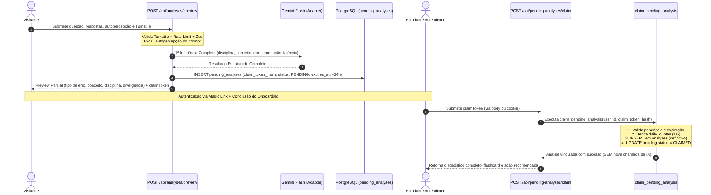

# Documentação Técnica: Reconciliação da Sprint 3 com o PRD v1.2

## Decisão posterior — prévia pública estática (2026-09-05)

Esta decisão substitui o fluxo de aquisição anônimo descrito abaixo, sem remover a infraestrutura legada necessária para resgatar análises pendentes ainda válidas:

- **Antes:** o visitante enviava uma questão própria, passava pelo Turnstile e executava uma inferência real de IA antes do cadastro. O resultado completo era armazenado em `pending_analyses`, e uma projeção parcial era mostrada na home.
- **Agora:** a home exibe somente uma demonstração estática, com uma questão e um diagnóstico de exemplo mantidos no código. Abrir a demonstração não chama IA, API ou banco de dados, não usa Turnstile e não cria cookies nem `pending_analysis`.
- O CTA **“Analisar meu próprio erro”** direciona para `/login`, sem `claim_ref`. A análise de questões próprias exige autenticação e onboarding completo e continua usando exclusivamente `POST /api/analyses`.
- `POST /api/analyses/preview` permanece como rota de compatibilidade, mas responde `410 Gone` e não aceita novas submissões.
- A infraestrutura de `pending_analyses`, o endpoint de claim e o transporte de `claim_ref` permanecem disponíveis apenas para resgatar pendências criadas antes desta decisão durante seu TTL normal.

As seções históricas abaixo documentam a implementação anterior e devem ser interpretadas à luz desta decisão posterior.

## 1. Objetivo e Escopo da Reconciliação
Esta etapa integrou os requisitos consolidados do **PRD v1.2 Consolidado** ao motor de IA e ao ciclo de vida da análise pedagógica, preservando integralmente todas as fundações, RLS, RPCs, quotas e migrações 0001–0007 já homologadas.

Principais capacidades introduzidas:
1. **Análise Anônima Parcial (`POST /api/analyses/preview`)**: Permite que o visitante experimente a análise prévia antes do cadastro.
2. **Armazenamento Seguro em `pending_analyses`**: Armazena o diagnóstico integral gerado na primeira inferência.
3. **Claim Token Criptográfico (Alta Entropia + Hash SHA-256)**: Resgate de uso único com TTL estrito de 24h (`expires_at`).
4. **Uma Única Inferência de IA**: O Gemini calcula todos os campos de uma só vez na fase anônima. O resgate pós-cadastro apenas vincula a análise à conta (`user_id`) e consome a cota diária de forma transacional e atômica, sem segunda chamada à IA.
5. **Isolamento de `user_attribution` (Anti-Contaminação)**: A autopercepção do estudante é coletada via taxonomia estruturada, mas é **terminantemente excluída** do payload enviado ao Gemini, garantindo diagnóstico independente.
6. **Cálculo de Divergência/Alinhamento**: Comparação entre autopercepção e diagnóstico da IA (métrica de alinhamento com a percepção do estudante).
7. **`recommendedAction` em 100% dos Casos**: Prescrição de conduta prática obrigatória em todas as saídas (inclusive `NO_CARD` e `INSUFFICIENT_INFORMATION`).
8. **Enum Fechado de Disciplinas**: Classificação em 17 disciplinas oficiais.
9. **Proteção Anti-Abuso**: Cloudflare Turnstile server-side + Rate Limiting por IP (HMAC) e `anonymous_id`.
10. **Telemetria Segregada (`anonymous_events`)**: Rastreamento do funil anônimo sem violar a restrição de `user_id NOT NULL` da tabela `events`.

---

## 2. Arquitetura e Estrutura de Banco de Dados

### 2.1 Migração Incremental `0008_pending_analyses.sql`
- **`public.analyses` (colunas aditivas)**:
  - `user_attribution TEXT`: autopercepção informada pelo estudante.
  - `discipline TEXT`: disciplina identificada pela IA.
  - `discipline_confirmed TEXT`: reservado para confirmação/ajuste pelo usuário na Sprint 4.
  - `ai_user_agreement BOOLEAN`: indicador de alinhamento entre a percepção e o diagnóstico da IA.
  - `recommended_action TEXT`: ação prática sugerida.
  - `latency_ms INT`: tempo de inferência em milissegundos.
  - `user_feedback TEXT` / `user_feedback_attribution TEXT`: campos para feedback futuro.
- **`public.pending_analyses` (server-only)**:
  - Tabela isolada com RLS onde `REVOKE ALL` foi aplicado para `PUBLIC, anon, authenticated` e `GRANT ALL` apenas para `service_role`.
  - Armazena `claim_token_hash` (SHA-256), `status` (`PENDING`, `CLAIMED`, `EXPIRED`), `expires_at` (`now() + 24 hours`).
- **`public.anonymous_events` (server-only)**:
  - Rastreamento dos eventos de telemetria anônima (`partial_analysis_started`, `partial_analysis_completed`, `pending_claimed`, `pending_expired`).

### 2.2 RPCs Transacionais
- **`claim_pending_analysis(p_user_id UUID, p_claim_token_hash TEXT)`**:
  - `SECURITY DEFINER`, `search_path = ''`.
  - Bloqueia o registro com `FOR UPDATE`.
  - Rejeita com `NOT_FOUND`, `ALREADY_CLAIMED` ou `EXPIRED` (> 24h).
  - Garante e debita a cota diária em `daily_quotas` (limite diário de 5).
  - Insere o registro definitivo em `analyses` com `user_id = p_user_id`.
  - Atualiza `pending_analyses` para `CLAIMED` com `claimed_by_user_id = p_user_id` e `claimed_at = now()`.
- **`cleanup_expired_pending_analyses()`**:
  - Atualiza análises pendentes que ultrapassaram 24h para `EXPIRED` e registra eventos correspondentes.

---

## 3. Fluxo de Dados



---

## 4. Manutenção e Operação

### 4.1 Limpeza Periódica de Pendentes Expiradas
Um cron job ou Edge Function pode executar periodicamente a RPC de limpeza:
```sql
SELECT public.cleanup_expired_pending_analyses();
```
Isso marca pendências com mais de 24h como `EXPIRED` e emite o evento `pending_expired` para métricas do funil.

### 4.2 Verificação de Anti-Contaminação
O teste unitário `tests/unit/anti-contamination.test.ts` deve ser mantido na pipeline de CI. Qualquer tentativa de adicionar `user_attribution` ao payload do adapter de IA falhará o build imediatamente.

### 4.3 Invariantes de Segurança
- `analyses.user_id` é obrigatório (`NOT NULL`).
- O token bruto de claim nunca é salvo no banco de dados, apenas seu hash SHA-256.
- Tabelas `pending_analyses` e `anonymous_events` são inacessíveis por tokens JWT `anon` ou `authenticated`.
